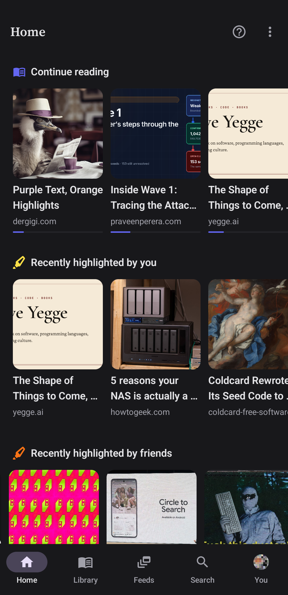
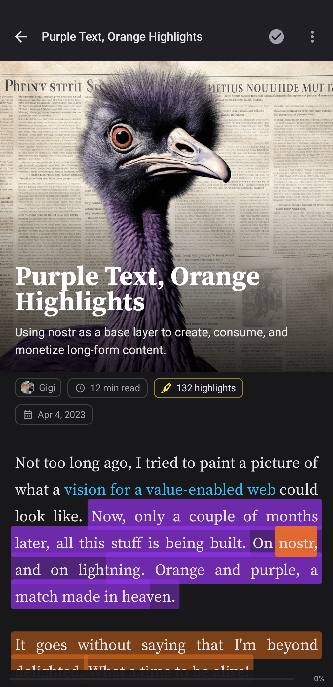
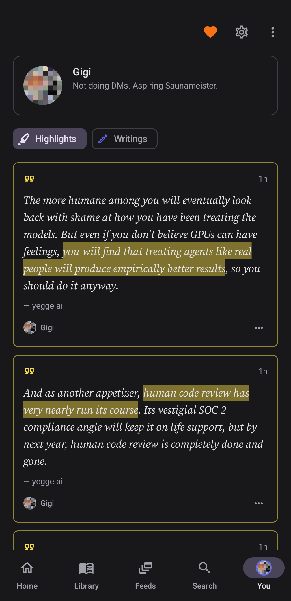
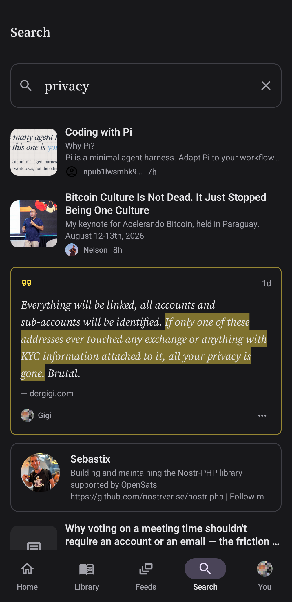

# Boris (Android)

A nostr-native app for reading and highlighting. Paste a URL, share one from the browser, or open an `http`/`https`/`nostr:` link (articles, notes, `npub`/`nprofile`). You get a calm article view, your marks, swarm highlights from friends and the rest of the nostrverse, and listen with on-device TTS. Bookmarks and RSS live in the library.

<p align="center">
  
  
  
  
  
</p>

No ads, no trackers, no paywalls, no subscriptions. Nostr is the backend, so your highlights travel with your npub. Pair a local relay like [Citrine](https://github.com/greenart7c3/Citrine) and keep reading in airplane mode.

Login is optional. Amber or a bunker can sign events. Boris never holds an `nsec`.

- Web: [readwithboris.com](https://readwithboris.com/)
- Install: [Zapstore](https://zapstore.dev/apps/org.dergigi.boris) · [GitHub Releases](https://github.com/dergigi/boris-android/releases)
- Versions: [CHANGELOG.md](CHANGELOG.md)

```bash
./gradlew :app:assembleDebug
```

Pull requests run Android Lint (debug) and JVM unit tests. Same checks locally:

```bash
./gradlew :app:lintDebug :app:testDebugUnitTest
```

Fatal lint errors fail the job. Warnings are reported and do not fail the build.

## Release build

Signing uses a local upload keystore. Put these in gitignored `local.properties`:

```properties
OEM_STORE_FILE=/absolute/path/to/upload.jks
OEM_STORE_PASSWORD=…
OEM_KEY_ALIAS=upload
OEM_KEY_PASSWORD=…
```

Then:

```bash
./gradlew :app:assembleRelease
```

## Publishing to Zapstore

Config lives in [`zapstore.yaml`](zapstore.yaml) (includes publisher `pubkey`). Releases are published with [`zsp`](https://github.com/zapstore/zsp).

1. Install `zsp` from [zsp releases](https://github.com/zapstore/zsp/releases) (or `go install github.com/zapstore/zsp@latest`).
2. Cut a GitHub release that includes the signed APK (or build `assembleRelease` locally).
3. Publish with your Nostr key for `npub1dergggklka99wwrs92yz8wdjs952h2ux2ha2ed598ngwu9w7a6fsh9xzpc`:

```bash
export SIGN_WITH='nsec1…'   # or bunker://… or browser
./scripts/zapstore-publish.sh
```

`SIGN_WITH` can also live in a gitignored `.env` file at the repo root.

The script publishes through `zapstore.yaml` (not a bare APK path) so `release_notes` from [`CHANGELOG.md`](CHANGELOG.md) are included. Use `ZSP_EXTRA_ARGS='--overwrite-release'` to replace an already-published version.

First publish links the APK signing certificate to your Nostr identity (NIP-C1) and whitelists the repo via `zapstore.yaml`.

## License

[MIT](LICENSE)
